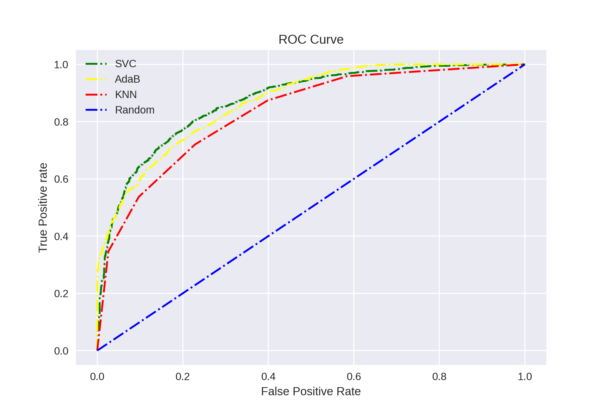

# Chess Predictor Model Comparison 
A comparison of three supervised models to predict the winner of a chess game given a set of moves and effectively evaluate how accurate each algorithm is. The three models compared are Support Vector Machine, AdaBoost, and K-Nearest Neighbor.
 
 

